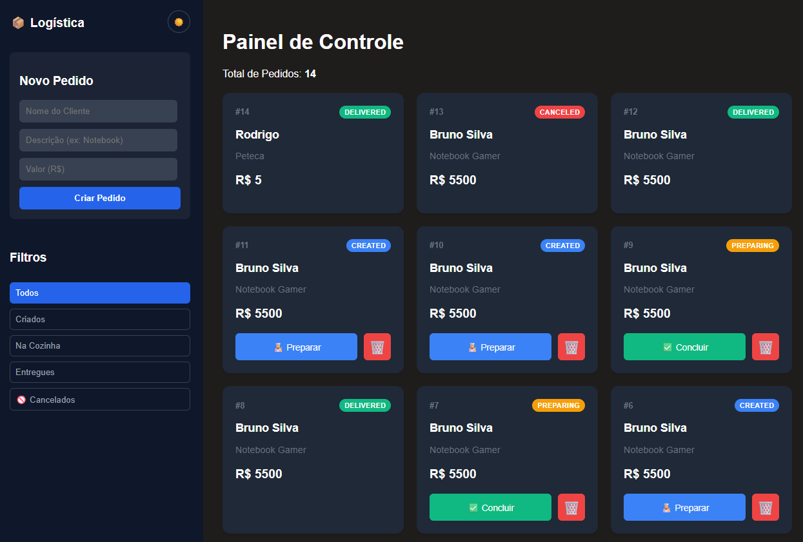

# 📦 Sistema de Logística Distribuída (EDA)

Uma plataforma Full Stack de logística que demonstra uma **Arquitetura Orientada a Eventos (EDA)**. O sistema simula o ciclo de vida de pedidos em tempo real, integrando microsserviços heterogêneos.


## 🚀 Arquitetura do Sistema

O projeto é um **Monorepo** composto por serviços independentes:

| Serviço | Tecnologia | Responsabilidade |
|---------|------------|------------------|
| **Core API** | Java 21 (Spring Boot 3) | Gerencia pedidos, regras de negócio e persistência (PostgreSQL). |
| **Frontend** | React.js (Vite) | Dashboard em tempo real com **Dark Mode** e **WebSockets**. |
| **Notification** | Node.js | Worker que consome filas do **RabbitMQ** para simular envio de e-mails. |
| **Analytics** | Python | Serviço de dados que processa streams do **Apache Kafka** para métricas financeiras. |

## 🛠️ Funcionalidades

* **Real-Time Dashboard:** Atualização de status via WebSockets (sem refresh).
* **Gestão de Pedidos:** Criar, Preparar, Entregar e Cancelar pedidos.
* **UX Aprimorada:** Interface responsiva com tema Dark/Light.
* **Processamento Assíncrono:** Uso de RabbitMQ para tarefas em background.
* **Event Sourcing:** Auditoria de eventos de pedidos via Kafka.

## ⚙️ Como Rodar Localmente

### Pré-requisitos
* Docker & Docker Compose
* Java 21 JDK
* Node.js & Python 3

### 1. Subir a Infraestrutura (Docker)
Na raiz do projeto:

```bash
docker-compose up -d
```
Isso iniciará: PostgreSQL, RabbitMQ, Zookeeper e Kafka.

2. Rodar os Serviços
Backend:

```bash
cd backend
./mvnw spring-boot:run
```

Frontend:

```bash
cd frontend-web
npm run dev
Acesse: http://localhost:5173
```

Workers:

```bash
# Terminal 3
node notification-worker/index.js

# Terminal 4
python analytics-service/main.py
```

 


